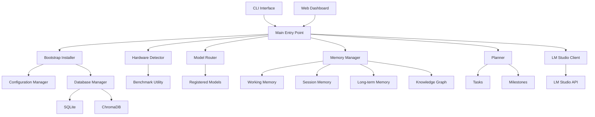
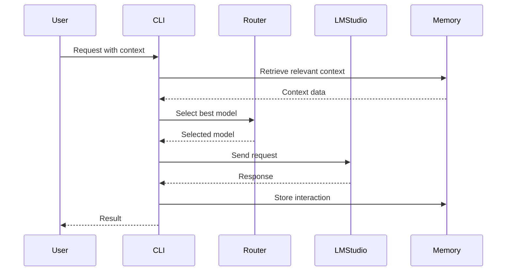

# Privantrix AI OS Architecture

## Overview

Privantrix AI OS is a modular, production-quality AI development environment that provides:
- Automatic hardware detection and benchmarking
- Intelligent model routing
- Multi-tier memory management
- Task planning and execution tracking
- LM Studio integration
- SQLite + ChromaDB storage

## System Architecture



## Component Details

### Bootstrap Installer
- Creates directory structure
- Sets up Python virtual environment
- Installs dependencies
- Initializes databases
- Generates configuration files
- Creates launch scripts
- Initializes Git repository

### Hardware Detector
- Detects CPU, RAM, GPU information
- Runs performance benchmarks
- Provides optimization recommendations

### Model Router
- Registers multiple AI models
- Selects optimal model based on requirements
- Tracks model performance statistics

### Memory Manager
- **Working Memory**: Short-term, LRU-evicted
- **Session Memory**: TTL-based expiration
- **Project Memory**: Project-specific persistence
- **Long-term Memory**: Compressed storage with indexing
- **Knowledge Graph**: Structured relationships

### Planner
- Creates execution graphs from roadmaps
- Manages tasks and milestones
- Assigns agents to tasks
- Tracks completion progress

### LM Studio Client
- Full OpenAI-compatible API client
- Streaming support
- Embedding generation
- Health checks and retry logic

## Data Flow



## Directory Structure

```
D:\Privantrix-AI-OS\AI-OS\
├── src/              # Source code modules
├── configs/          # Configuration files
├── database/         # SQLite databases
├── embeddings/       # ChromaDB vector store
├── memory/           # Memory JSON files
├── projects/         # Project data
├── logs/             # Log files
├── checkpoints/      # System checkpoints
├── benchmarks/       # Benchmark results
├── backups/          # Backup files
├── scripts/          # Utility scripts
└── docs/             # Documentation
```

## Configuration

Configuration is managed through:
1. `.env` file for environment variables
2. `configs/config.yaml` for application settings
3. `configs/models.json` for model registrations

## Security Considerations

- All data stored locally on D: drive
- No external telemetry
- Configuration files excluded from version control
- Database backups supported
